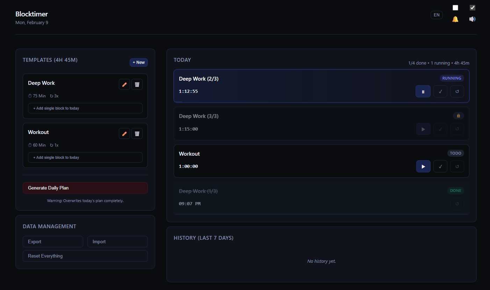

# ⏱️ Blocktimer

> **A "Vibecoding" Project**  
> _Started with OpenAI Codex, evolved and modernized with Google Antigravity._

Blocktimer is a simple, beautiful, and privacy-focused time-blocking application that runs entirely in your browser. No servers, no tracking, just you and your focus blocks. It is contained within a **single HTML file**.

## ✨ Features

- **🎯 Focus Blocks**: Create daily schedules with custom block durations.
- **🎨 Modern Dark UI**: A "Midnight Blue" aesthetic with clear visual states for running, paused, and completed tasks.
- **� Local First**: All data is stored in your browser's `localStorage`. Nothing leaves your device.
- **🔄 Templates**: Save frequently used days as templates for quick setup.
- **⚡ Real-time Timer**: Distraction-free timer with progress bars and "always-on" tab title updates.
- **� Notifications**: Optional sound and desktop notifications when a block finishes.
- **☁️ Export/Import**: Backup your history and settings to a JSON file.

## 🛠️ Tech Stack

- **Single File**: All logic (HTML, CSS, JS) is in one `index.html`.
- **Zero Dependencies**: No frameworks, no build tools. standard web technologies.
- **Vibecoding**: Built through conversation and iteration with AI assistants.

## 🚀 Usage

Simply open `index.html` in any modern web browser.

## 📜 History

This project is an experiment in AI-assisted coding ("Vibecoding"):
1.  **Inception**: Created with **Codex** to build a functional prototype.
2.  **Evolution**: Refined, modernized, and polished with **Antigravity** (2026), adding a robust UI, dark mode, and fixing core logic.

---

_Enjoy your focus blocks!_
